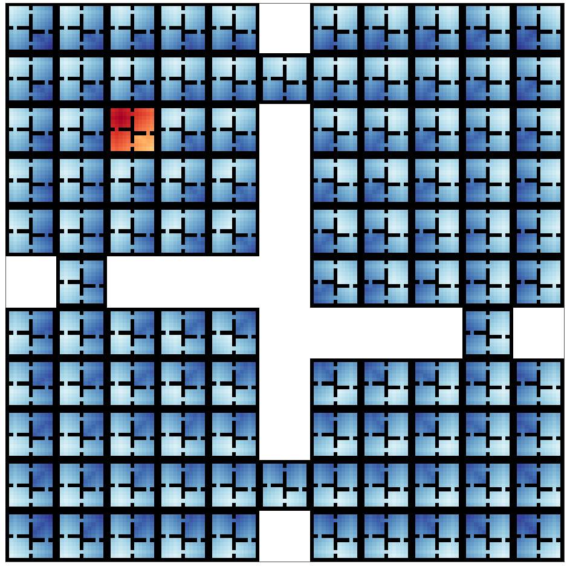
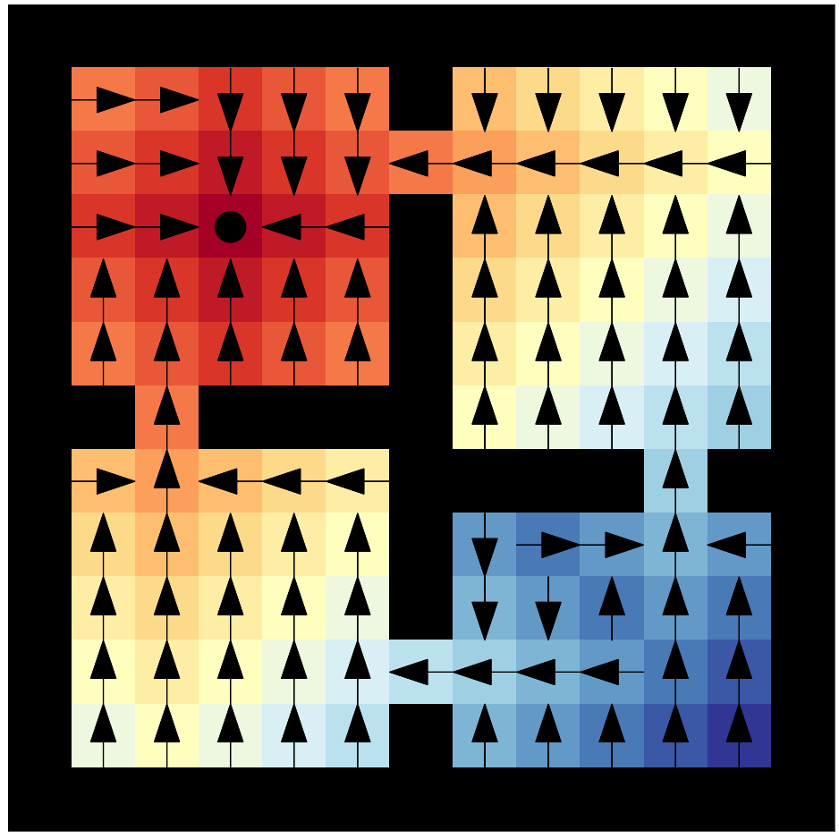
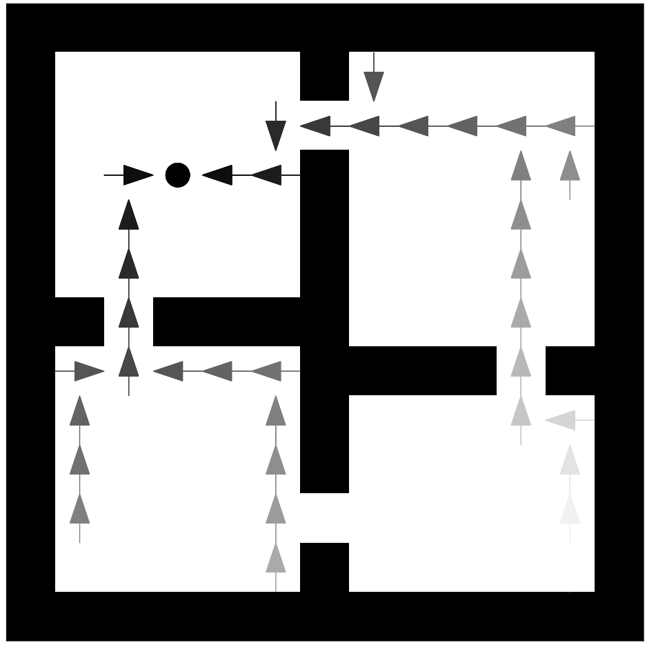

Code for the paper "World Value Functions: Knowledge Representation for Learning and Planning": https://prl-theworkshop.github.io/prl2022-icaps/papers/PRL2022_paper_10.pdf

To learn a world value function, run:
```
python learn_wvf.py
```
  

To infer transition probabilities using the learned world value function, run:
```
python wvf_dynamics.py
```


To plan using the inferred transition probabilities, run:
```
python wvf_planning.py
```


To reproduce an experiment from the paper, run:
```
python exp.py
```
